# گزارش آزمایش پنجم آزمایشگاه مهندسی نرم‌افزار

## بخش اول
###  انجام profiling و یافتن مشکل برنامه
در این مرحله از آزمایش ابتدا با استفاده از YourKit عملیات profiling را روی JavaCup انجام دادیم.

خروجی به شرح زیر است:

مصرف cpu:
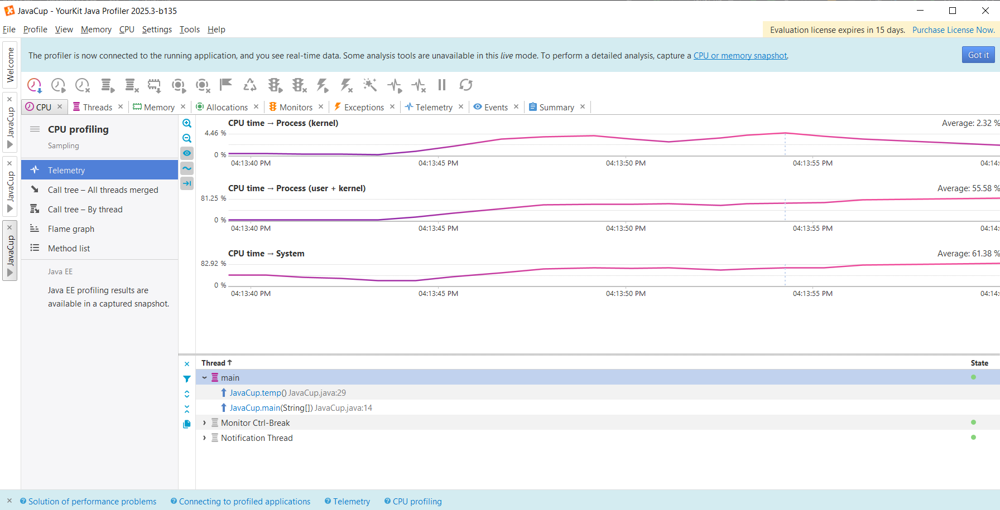
مصرف حافظه:
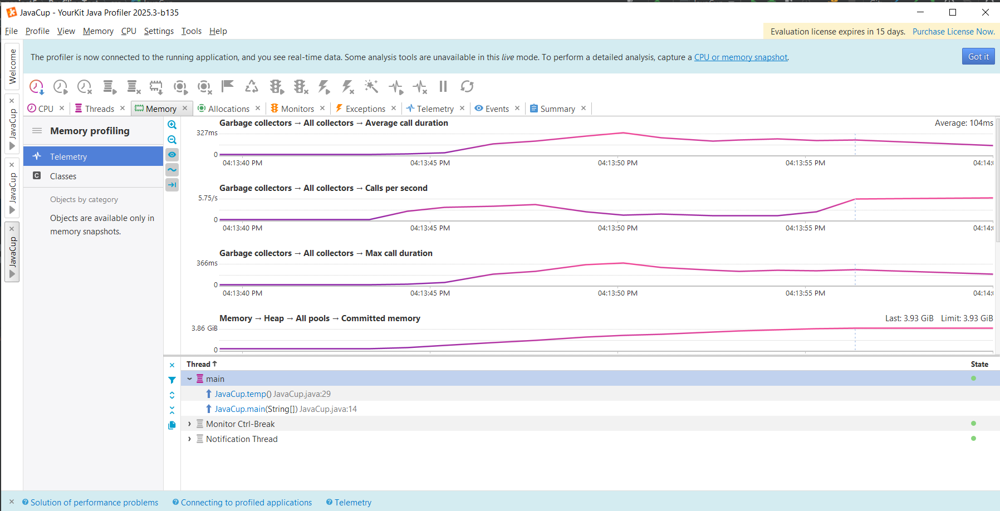

طبق این خروجی واضح است که تابع temp تمام حافظه‌ی heap در دسترس را مصرف می‌کند و در نهایت نیز به همین دلیل برنامه با خطا مواجه می‌شود.

برای حل این مشکل با بررسی تابع temp متوجه شدیم که در این تابع یک ArrayList بدون اندازه‌ی اولیه تعریف شده‌است و با بزرگ شدن بیش از اندازه‌ی این ArrayList تمام حافظه‌ی heap مصرف شده است.

### حل مشکل برنامه

برای اصلاح برنامه تابع temp را تغییر داده و اندازه‌ی ArrayList را برابر با حداکثر المان‌هایی که خواهد داشت قرار دادیم.
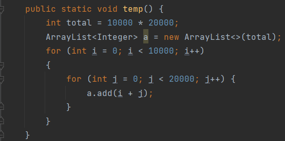

با این اصلاح، مشکل حافظه حل شد و برنامه به درستی اجرا شد.

تحلیل profiling این کد پس از اصلاح در ادامه آمده است.

مصرف cpu:
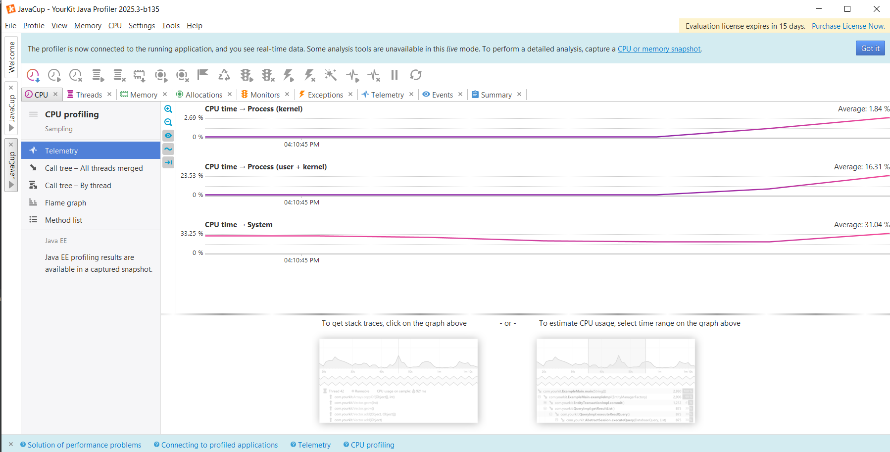
مصرف حافظه:
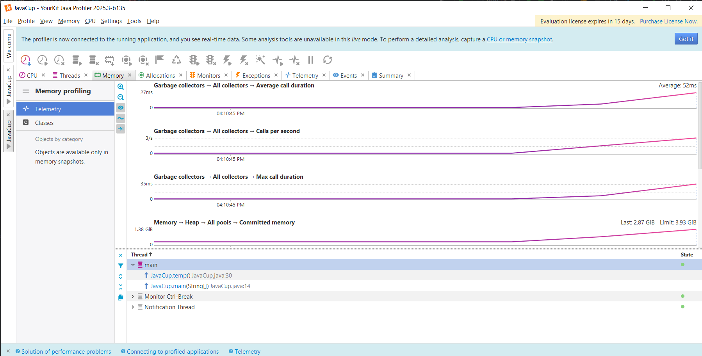

## بخش دوم
در این بخش خودمان کدی به زبان جاوا نوشتیم تا یک رشته از کاراکترهای رندوم به طول یک میلیون را تولید کند. ابتدا این کد را با داده ساختار نامناسب استرینگ مینویسیم تا مصرف حافظه نابهینه باشد.
کد تولید رشته تصادفی:
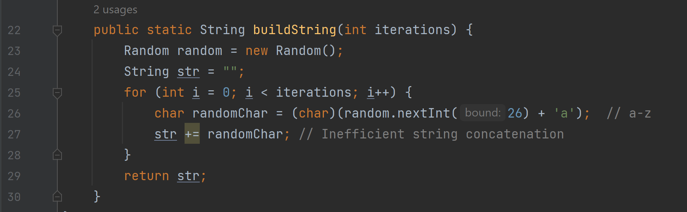
و خروچی پروفایلینگ را مشاهده میکنیم:
مصرف cpu:
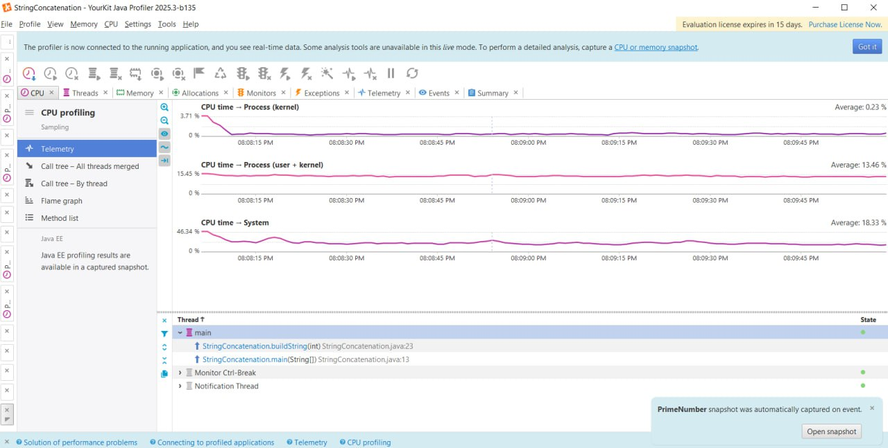
مصرف حافظه:
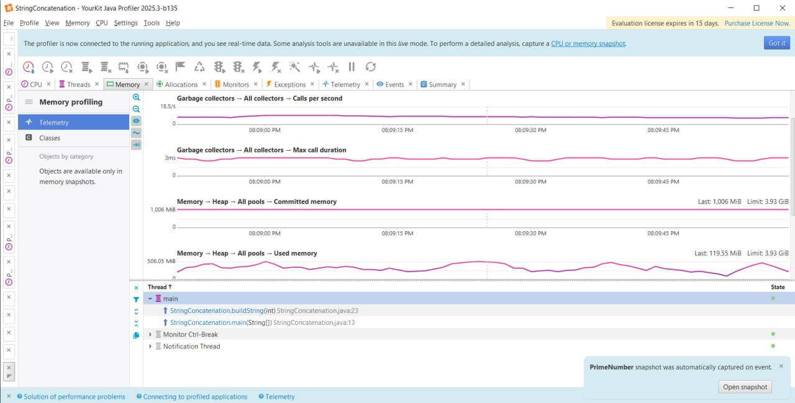

براساس نمودارهای بالا، می‌توان نتیجه‌گیری کرد که مشکل از نحوه پیاده‌سازی buildString می‌باشد. پس از بررسی این پیاده‌سازی بنظر میرسد که استفاده از داده‌ساختار StringBuilder برای این کاربرد مناسب‌‌تر می‌باشد. پس این بخش از کد را مطابق تصویر زیر تغییر می‌دهیم.

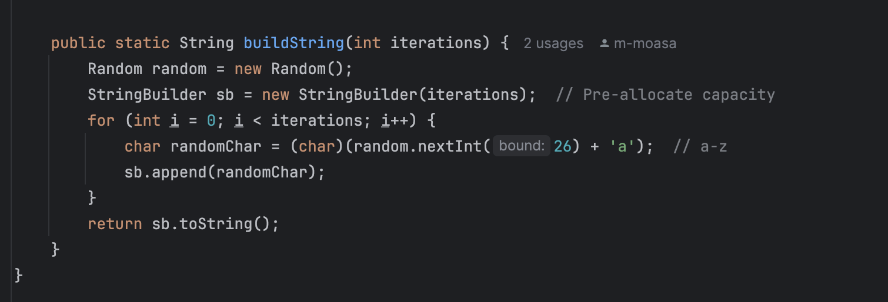

حال با کمک ابزار yourkit دوباره به بررسی عملکرد می‌پردازیم. همان‌طور که در تصویر مشاهده می‌شود، مصرف تمامی منابع سخت‌افزاری موجود پس از این تغییر بهینه شده‌اند.

بررسی عملکرد CPU:

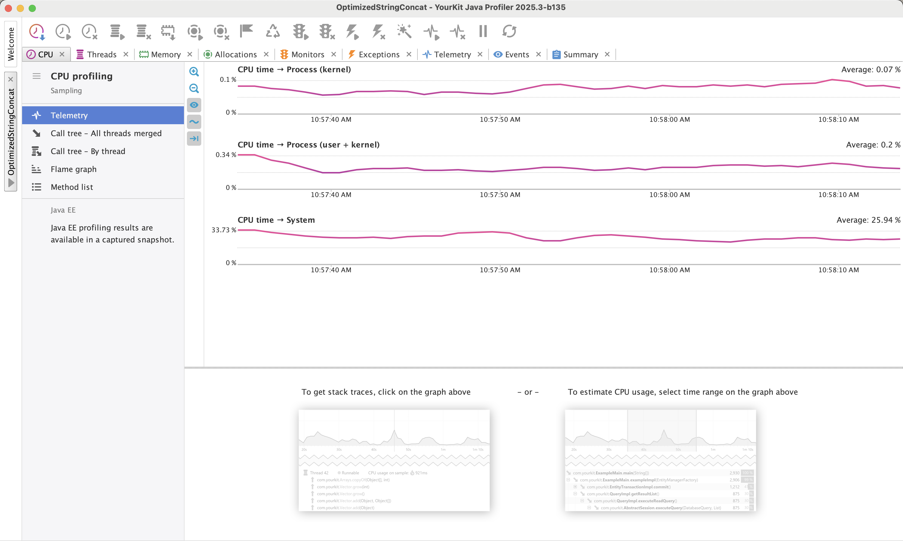

بررسی عملکرد Memory:

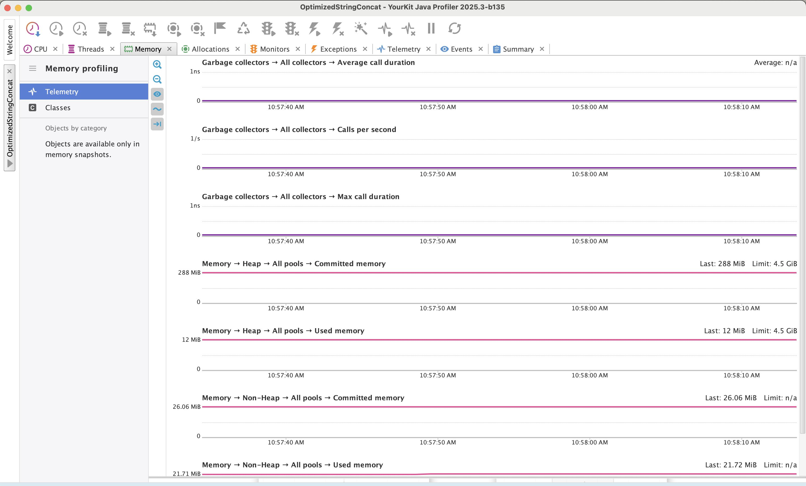
